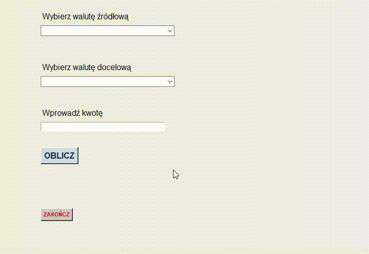

# Kalkulator walut

## O aplikacji

Aplikacja służy do przeliczania kursów walut.<br>
Użytkownik ma do wyboru 36 różnych walut.<br>
Waluty można wybierać z następujących list rozwijanych:<br>

 - <b><em>Wybierz walutę źródłową</em></b> - waluta, którą chcemy przeliczyć,
 - <b><em>Wybierz walutę docelową</em></b> - waluta, na którą chcemy przeliczyć wcześniej wybraną walutę źródłową.

W polu <b><em>Wprowadź kwotę</em></b> podajemy kwotę, którą chcemy przeliczyć.<br>
Po kliknięciu przycisku <b><em>Oblicz</em></b> wyświetli się przeliczona wartość w walucie docelowej.

Przycisk <b><em>Zakończ</em></b> zamyka aplikację.

## Instalowanie

Do uruchomienia aplikacji potrzebne jest zainstalowanie następujących pythonowych bibliotek:

- tkinter,
- xmltodict,
  
aby to zrobić należy wpisać w wierszu poleceń następujące polecenia:

```shell
pip install tkinter
```
```shell
pip install xmltodict
```
Należy również zainstalować moduł potrzebny do stworzenia pliku wykonalnego aplikacji:

```shell
pip install pyinstaller
```
Z projektu należy pobrać pliki <b><em>kursy_walut.py</em></b> oraz <b><em>kursy_walut.xml</em></b>.<br>
Należy pamiętać o tym, aby następne kroki wykonać z poziomu folderu, w którym znajdują się pobrane pliki.<br>
W celu zbudowania wykonalnego pliku należy wpisać w wierszu poleceń:

```shell
pyinstaller kursy_walut.py
```
oraz 

```shell
pyinstaller --onefile --windowed kursy_walut.py
```
Po wpisaniu tych poleceń wygeneruje się folder <b><em>dist</em></b>, w którym znajduje się plik z rozszerzeniem <b><em>.exe</em></b> ze zbudowaną aplikacją.

## Demo aplikacji


